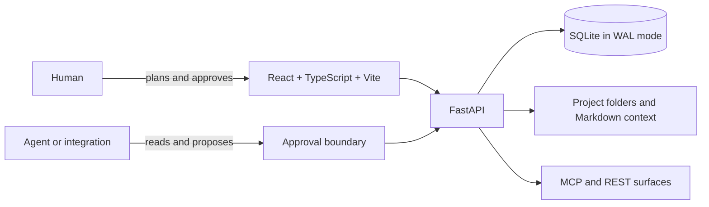

<p align="center">
  
</p>

<h1 align="center">Planarus</h1>

<p align="center">
  <strong>Plan clearly. Navigate safely. Achieve with control.</strong><br />
  A local-first project cockpit where AI agents propose and people approve.
</p>

<p align="center">
  <a href="https://github.com/Sdomit/Planarus/actions/workflows/ci.yml"></a>
  <a href="LICENSE"></a>
  
  
</p>

---

## What is Planarus?

Planarus is the operating surface around an AI-assisted project. It keeps the
plan, decisions, risks, work, documentation, context files, and execution
signals together on your machine—then gives coding agents a narrow, useful view
of that context.

Its central rule is simple:

> **AI agents can read and propose. Humans approve and apply.**

An agent never receives a direct path to mutate canonical project state through
the MCP or external API. Instead, it creates a reviewable proposal. You inspect
the proposed change in Planarus, approve it, and the same internal path applies
and audits it.

| Planarus helps you | Without asking you to give up |
| --- | --- |
| Keep a living project plan beside the work | Your local files, database, and control |
| Give agents the right context at the right time | An approval boundary for agent-originated changes |
| Track tasks, decisions, risks, docs, and milestones together | A cloud account or per-seat subscription |
| Connect agents through MCP, REST, or guided integrations | An always-open remote API |

## Why it is different

Most project tools organize human work. Most AI tools organize a conversation.
Planarus organizes the boundary between the two:

1. **Local-first by default** — SQLite, project folders, Markdown context, and
   loopback services stay on your machine.
2. **Context that agents can actually use** — a generated, ordered context pack
   gives an agent scoped project memory instead of a large, unstructured dump.
3. **Approval-first execution** — proposed agent writes wait in an approval
   queue; external agents do not approve, apply, or delete canonical data.
4. **Power is opt-in** — LAN team mode, calendar sync, webhooks, scheduled
   reminders/backups, and remote agent access all start disabled.

## Product surfaces

| Area | What you can do |
| --- | --- |
| **Plan** | Projects, phases, milestones, tasks, sub-tasks, boards, roadmap, timeline, calendar, decisions, risks, and checklists |
| **Context** | Rich documents, Markdown preview, context-pack generation, context files, and an offline canvas |
| **Agents** | Review approval proposals, inspect agent runs, view notifications/reminders, and use the read-only Git cockpit |
| **Control** | Manage team access, integrations, MCP/API configuration, webhooks, export/import, and local backups |

## Run Planarus

### Fastest path: Docker

Docker is the simplest way to evaluate Planarus. You do not need Python, Node,
or pnpm on the host.

```bash
git clone https://github.com/Sdomit/Planarus.git
cd Planarus
docker compose up --build
```

Open [http://localhost:5173](http://localhost:5173).

- Data persists in `./planarus-data` on the host.
- Project folders created in the container must live under `/data` to persist.
- The Docker web port binds to `127.0.0.1` by default; it is not exposed to your
  LAN.
- If port 5173 is busy, use `PLANARUS_PORT=5174 docker compose up --build`.
- Stop the stack with `docker compose down`.

### Native development with hot reload

For development, Planarus includes launchers that migrate the database, start
the API and Vite app, wait for both services, and open the UI. They keep the
external API disabled.

**Prerequisites:** Python 3.11, Node.js 20+, and the pnpm version pinned by the
repository (`corepack enable` is the recommended installation route).

```bash
# From the repository root, once per checkout
corepack enable
pnpm install

# Create the API environment and install its development dependencies
cd apps/api
python3 -m venv .venv

# macOS / Linux
source .venv/bin/activate

# Windows PowerShell (run this instead of the line above)
# .venv\Scripts\Activate.ps1

pip install -e ".[dev]"
alembic upgrade head
cd ../..
```

Then launch both services:

```bash
./run-planarus.sh   # macOS / Linux
run-planarus.bat    # Windows
```

The launcher chooses free loopback ports when necessary. In the usual case:

| Service | Address |
| --- | --- |
| Web app | `http://localhost:5173` |
| API health | `http://localhost:8000/health` |
| Interactive API docs | `http://localhost:8000/docs` |

> **Important:** run backend commands from `apps/api`. The local SQLite path is
> relative to the working directory; starting it elsewhere can create an empty,
> separate database.

For the full developer reference—including Windows details, alternate frontend
ports, and troubleshooting—see [Developer setup](docs/dev/setup.md).

## Technical architecture



| Layer | Technology | Responsibility |
| --- | --- | --- |
| Web | React 19, TypeScript, Vite | Responsive product UI, planning surfaces, rich documents, canvas, and approvals |
| API | FastAPI, Python 3.11 | Typed REST endpoints, OpenAPI docs, business rules, and internal approval engine |
| Data | SQLModel, Alembic, SQLite/WAL | Local canonical state with schema migration discipline |
| Context | Project folders + generated Markdown | Portable, Git-friendly context packs for humans and agents |
| Agent access | STDIO MCP, opt-in remote HTTP MCP, REST | Narrow read/propose contracts that share the same approval rules |

The project is an `apps/web` + `apps/api` monorepo. Tauri desktop packaging is
planned but not yet shipped; today Planarus runs as a local web UI backed by a
local FastAPI service.

## Connect an agent safely

Planarus supports several agent-facing paths. They are intentionally distinct:

| Path | Default posture | Start here |
| --- | --- | --- |
| Local MCP (STDIO) | Private to the local machine; read/propose only | Settings → Integrations in the app |
| REST / external API | Disabled and loopback-only until explicitly configured | [ChatGPT connection guide](docs/guide/connect-planarus-to-chatgpt.md) |
| Remote HTTP MCP | Opt-in advanced integration | Settings → Integrations and the integration documentation |

For a private ChatGPT connection, follow the
[step-by-step guide](docs/guide/connect-planarus-to-chatgpt.md). It keeps the
local application private by default and exposes only a deliberately scoped,
read-only integration path when you choose to configure one.

## Optional capabilities

Nothing in this table is enabled by the quickstart.

| Capability | What it adds | Guide |
| --- | --- | --- |
| LAN team mode | Local accounts, attribution, and soft edit locks for a small trusted network | [LAN team mode](docs/guide/lan-team-mode.md) |
| Calendar sync | Explicit Google/Microsoft connections | [Connect a calendar](docs/guide/connect-your-calendar.md) |
| Notifications & backups | OS-scheduled reminders and verified local database snapshots | [Notifications & backups](docs/guide/notifications-and-backup.md) |
| Hosted go-live | The documented path for deliberately enabling a hosted deployment | [Hosted go-live](docs/guide/hosted-go-live.md) |

## Validate a checkout

Run these before opening a pull request:

```bash
# Backend — from apps/api
python -m pytest

# Frontend — from the repository root
pnpm test:web
pnpm typecheck:web
pnpm build:web
```

CI additionally verifies the Postgres migration path and a Docker Compose smoke
test. See [Contributing](CONTRIBUTING.md) for the focused pull-request workflow.

## Project status

Planarus is a working, local-first pre-1.0 application used daily by its
author. Phases 1–18 are built: planning, structured docs, approval workflows,
MCP/API boundaries, LAN team mode, Git cockpit, offline canvas, integrations,
notifications, and verified backups.

The hosted/SaaS groundwork exists but is not enabled by default. Desktop
packaging has not started. Those boundaries are deliberate: the current product
is designed to be useful and safe on one local machine first.

## Documentation map

- [Developer setup](docs/dev/setup.md) — prerequisites, hot reload, API, tests
- [Product and architecture plan](docs/plan/00-OVERVIEW.md) — product scope,
  design decisions, and technical architecture
- [User guides](docs/guide/) — ChatGPT, calendar, LAN team mode, notifications,
  backups, and hosted go-live
- [Contributing](CONTRIBUTING.md) — contribution workflow and non-negotiable
  safety invariants
- [Security policy](SECURITY.md) — private vulnerability reporting and scope

## Contributing and security

Contributions are welcome. Please keep the product’s trust model intact:
external AI clients may read data and create pending proposals, but they must
never directly approve or apply canonical changes. Read
[CONTRIBUTING.md](CONTRIBUTING.md) before opening a pull request.

For vulnerabilities, **do not open a public issue**. Use
[private vulnerability reporting](SECURITY.md) instead.

## License

Planarus is released under the [Apache License 2.0](LICENSE). Bundled fonts keep
their own licenses; see [NOTICE](NOTICE).
