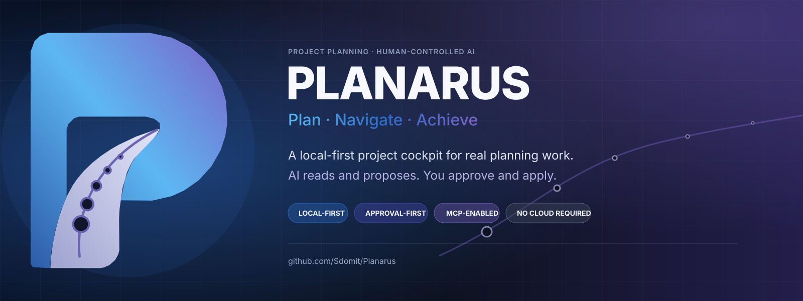
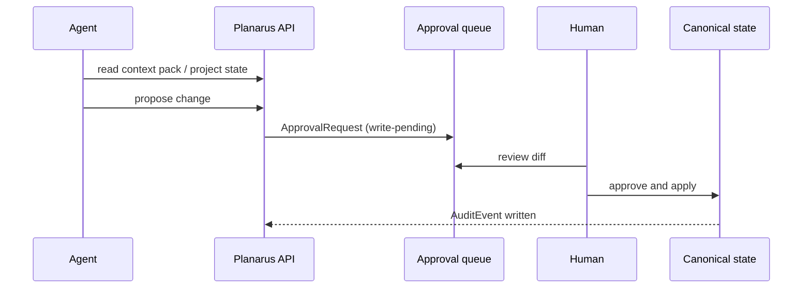
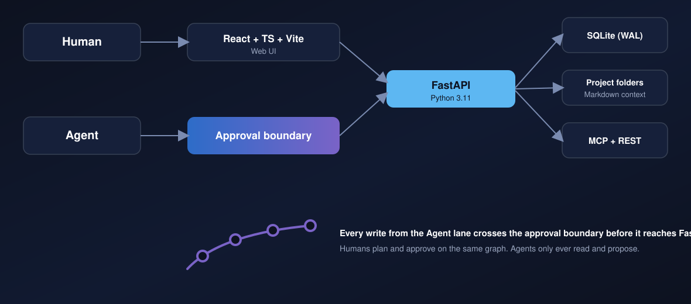
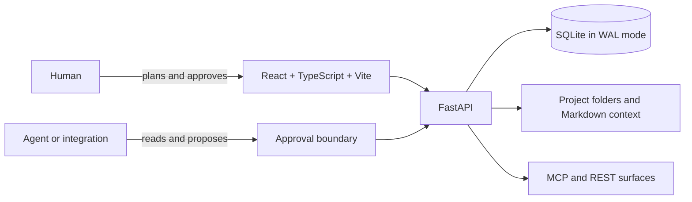

<p align="center">
  
</p>

<p align="center">
  <a href="https://github.com/Sdomit/Planarus/actions/workflows/ci.yml"></a>
  <a href="LICENSE"></a>
  
  
  
</p>

<p align="center">
  
  
  
  
  
  
  
  
</p>

<p align="center">
  <a href="#quickstart"><b>Quickstart</b></a> ·
  <a href="#the-trust-model"><b>Trust model</b></a> ·
  <a href="#architecture"><b>Architecture</b></a> ·
  <a href="#connect-an-agent"><b>Connect an agent</b></a> ·
  <a href="#documentation-map"><b>Docs</b></a> ·
  <a href="#contributing"><b>Contributing</b></a>
</p>

<p align="center">
  
</p>

---

##  Overview

Planarus is a project management application that runs on your machine. It holds
the plan, decisions, risks, work, documentation, context files, and execution
signals in one place — boards, roadmap, timeline, calendar, and rich docs — and
it is complete on its own, with no agent connected and no account to create.

Bring an agent in and the same store hands it a narrow, ordered view of that
context instead of a re-pasted transcript. Everything it proposes lands in a
queue you review.

Its central rule is one sentence long:

> [!IMPORTANT]
> **AI agents can read and propose. Humans approve and apply.**
>
> No external agent receives a path to mutate canonical project state through
> MCP or the REST API. An agent creates a reviewable proposal; you inspect it
> in the approval queue; the same internal service layer applies and audits it.

| Planarus gives you | Without asking you to give up |
| --- | --- |
| A living plan that sits beside the work | Your local files, database, and control |
| The right context at the right time for agents | An approval boundary on agent-originated writes |
| Tasks, decisions, risks, docs, and milestones in one graph | A cloud account or per-seat subscription |
| Agent access over MCP, REST, or guided integrations | An always-open remote API |

### Why it is different

Most project tools organize human work. Most AI tools organize a conversation.
Planarus organizes the boundary between the two.

1. **Local-first by default.** SQLite in WAL mode, real project folders,
   Markdown context, loopback services. Nothing leaves the machine unless you
   deliberately connect it.
2. **A complete planner on its own.** Phases, stages, milestones, tasks and
   sub-tasks, boards, roadmap, timeline, calendar, decisions, risks, checklists
   and documents all work with zero agents connected. AI is a layer you add, not
   a dependency you accept.
3. **Context agents can actually use.** A generated, ordered context pack gives
   an agent scoped project memory — pointers to files, not an unstructured dump.
   Token efficiency is treated as a product feature, not an optimization.
4. **Approval-first execution.** Proposed agent writes wait in a queue. External
   agents never approve, apply, or delete canonical data.
5. **Power is opt-in.** LAN team mode, calendar sync, webhooks, scheduled
   reminders and backups, and remote agent access all start disabled.

---

##  Quickstart

### Docker — fastest path to a running app

No Python, Node, or pnpm needed on the host.

```bash
git clone https://github.com/Sdomit/Planarus.git
cd Planarus
docker compose up --build
```

Open <http://localhost:5173>.

| Detail | Behaviour |
| --- | --- |
| Data | Persists on the host in `./planarus-data` |
| Project folders | Must live under `/data` inside the container to persist |
| Network posture | Web port binds to `127.0.0.1`; the API port is not published |
| External API | Disabled (`PLANARUS_EXTERNAL_API_ENABLED=false`) |
| Port conflict | `PLANARUS_PORT=5174 docker compose up --build` |
| Shutdown | `docker compose down` |

### Native development with hot reload

**Prerequisites:** Python 3.11, Node.js 20+, and the pnpm version pinned by the
repository (`corepack enable` is the recommended route).

```bash
# Once per checkout, from the repository root
corepack enable
pnpm install

# API environment and development dependencies
cd apps/api
python3 -m venv .venv
source .venv/bin/activate          # macOS / Linux
# .venv\Scripts\Activate.ps1       # Windows PowerShell — use instead of the line above
pip install -e ".[dev]"
alembic upgrade head
cd ../..
```

Launch both services with the bundled launcher — it migrates the database,
starts the API and the Vite app, waits for both, opens the UI, and keeps the
external API disabled:

```bash
./scripts/run-planarus.sh   # macOS / Linux
scripts\run-planarus.bat    # Windows
```

| Service | Address |
| --- | --- |
| Web app | `http://localhost:5173` |
| API health | `http://localhost:8000/health` |
| Interactive API docs | `http://localhost:8000/docs` |

> [!WARNING]
> **Run backend commands from `apps/api`.** The SQLite path is relative to the
> working directory; starting elsewhere silently creates a second, empty
> database.

Windows specifics, alternate frontend ports, and troubleshooting live in
[Developer setup](docs/dev/setup.md).

---

##  The trust model

Every agent-facing surface — STDIO MCP, remote HTTP MCP, ChatGPT Actions, the
external REST API — resolves to the same two verbs.



Four invariants hold across the codebase, and pull requests are expected to keep
them intact:

- **One write path.** MCP tools and REST endpoints share the `services/` layer,
  so there is a single governance and audit path.
- **Approval-gated external writes.** Only an authenticated local human action
  applies canonical state.
- **Deny-by-default power.** No shell execution, no arbitrary filesystem
  browsing, no Git mutation, no auto-apply.
- **Everything is audited.** Each state change writes an `AuditEvent`, mirrored
  to `.planarus/audit-log.jsonl`.

---

##  Product surfaces

<table>
  <tr>
    <td width="25%" align="center"><br /><b>Plan</b><br /><sub>Phases, tasks, boards, roadmap, timeline, decisions, risks</sub></td>
    <td width="25%" align="center"><br /><b>Context</b><br /><sub>Rich docs, Markdown preview, context packs, offline canvas</sub></td>
    <td width="25%" align="center"><br /><b>Agents</b><br /><sub>Approval proposals, agent runs, notifications, Git cockpit</sub></td>
    <td width="25%" align="center"><br /><b>Control</b><br /><sub>Team access, integrations, MCP/API config, backups</sub></td>
  </tr>
</table>

<details>
<summary>Full surface breakdown</summary>

| Area | What you can do |
| --- | --- |
| Plan | Projects, phases, stages, milestones, tasks, sub-tasks, boards, roadmap, timeline, calendar, decisions, risks, checklists |
| Context | Rich documents, Markdown preview, context-pack generation, context files, offline canvas |
| Agents | Review approval proposals, inspect agent runs, read notifications and reminders, use the read-only Git cockpit |
| Control | Team access, integrations, MCP/API configuration, webhooks, export/import, local backups |

</details>

---

##  Architecture

<p align="center">
  
</p>

<details>
<summary>Mermaid source (renders live on GitHub)</summary>



</details>

| Layer | Technology | Responsibility |
| --- | --- | --- |
| Web | React 19, TypeScript, Vite, Tiptap | Planning surfaces, rich documents, canvas, approvals |
| API | FastAPI, Python 3.11 | Typed REST endpoints, OpenAPI 3.1, business rules, approval engine |
| Data | SQLModel, Alembic, SQLite/WAL | Local canonical state with migration discipline |
| Context | Project folders + generated Markdown | Portable, Git-friendly context packs for humans and agents |
| Agent access | STDIO MCP, opt-in remote HTTP MCP, REST | Narrow read/propose contracts under shared approval rules |

### Repository layout

```
apps/web/     React + TS + Vite application
apps/api/     FastAPI service — api · models · schemas · services · fsmemory
              prompt · policy · mcp · db · core, plus alembic and tests
docs/guide/   User guides: ChatGPT, calendar, LAN team mode, notifications, go-live
docs/api/     Generated OpenAPI contracts for the external surface
docs/dev/     Developer setup
deploy/       Hosted deployment compose files and notes
scripts/      One-command launchers for macOS/Linux and Windows
.github/      CI, issue templates, and the contribution and security policies
```

The monorepo is `apps/web` + `apps/api`. The database is authoritative for
structured data; versioned editor `content_json` is authoritative for free-form
docs; exported Markdown and the generated `context/*` pack inside each managed
project folder are derived. Postgres portability is
kept through portable models plus an explicit application-level ETL — not a URL
switch. Tauri 2 desktop packaging is planned and not yet started.

---

##  Connect an agent

Optional — the app is fully usable without any of this. When you do want an
agent involved, the agent-facing paths are deliberately distinct, with different
default postures.

| Path | Default posture | Start here |
| --- | --- | --- |
| Local MCP (STDIO) | Private to the local machine; read and propose only | Settings → Integrations |
| REST / external API | Disabled and loopback-only until explicitly configured | [ChatGPT connection guide](docs/guide/connect-planarus-to-chatgpt.md) |
| Remote HTTP MCP | Opt-in advanced integration | Settings → Integrations |

Machine-readable contracts for the ChatGPT Actions surfaces ship in the repo:
[`docs/api/planarus-gpt-actions-readonly.openapi.json`](docs/api/planarus-gpt-actions-readonly.openapi.json)
and
[`docs/api/planarus-gpt-actions-read-propose.openapi.json`](docs/api/planarus-gpt-actions-read-propose.openapi.json).

---

##  Optional capabilities

> [!NOTE]
> Nothing below is enabled by the quickstart — every capability here starts off.

| Capability | What it adds | Guide |
| --- | --- | --- |
|  Team mode | Local accounts, attribution, and soft edit locks for a small trusted network | [LAN team mode](docs/guide/lan-team-mode.md) |
|  Calendar sync | Explicit Google or Microsoft connections | [Connect a calendar](docs/guide/connect-your-calendar.md) |
|  Notifications and backups | OS-scheduled reminders and verified local database snapshots | [Notifications and backups](docs/guide/notifications-and-backup.md) |
|  Team administration | Roles, invitations, and attribution for LAN deployments | [Team administration](docs/guide/team-administration.md) |
|  Hosted go-live | The documented path for deliberately enabling a hosted deployment | [Hosted go-live](docs/guide/hosted-go-live.md) |

---

##  Validate a checkout

```bash
# Backend — from apps/api
python -m pytest

# Frontend — from the repository root
pnpm test:web
pnpm typecheck:web
pnpm build:web
```

CI additionally verifies the Postgres migration path and a Docker Compose smoke
test. See [Contributing](.github/CONTRIBUTING.md) for the focused pull-request
workflow.

---

##  Project status

> [!TIP]
> Planarus is a working, pre-1.0, local-first application used daily by its
> author. Phases 1–19 and 22 are built: planning entities, structured docs,
approval workflows, MCP and API boundaries, LAN team mode, the read-only Git
cockpit, offline canvas, the integration hub, notifications, verified backups,
the planning graph, and entity attachments.

Hosted groundwork exists but stays disabled by default. Desktop packaging has
not started. Both boundaries are deliberate: the product is designed to be
useful and safe on one local machine first, and every later capability is an
additive layer rather than a rewrite.

---

##  Documentation map

| Document | Read it for |
| --- | --- |
| [docs/README.md](docs/README.md) | Index of everything below |
| [docs/dev/setup.md](docs/dev/setup.md) | Prerequisites, hot reload, API, tests |
| [docs/guide/](docs/guide/) | ChatGPT, calendar, LAN team mode, notifications, backups, go-live |
| [docs/api/](docs/api/) | Generated OpenAPI contracts for the external surface |
| [.github/CONTRIBUTING.md](.github/CONTRIBUTING.md) | Contribution workflow and non-negotiable safety invariants |
| [.github/SECURITY.md](.github/SECURITY.md) | Private vulnerability reporting and scope |
| [CHANGELOG.md](CHANGELOG.md) | Release-level history |

The design notes and per-phase build record are maintainer-local and not
published; the reasoning that outlives them lives in the code and its tests.

---

##  Contributing

Contributions are welcome. Keep the trust model intact: external AI clients may
read data and create pending proposals, and must never directly approve or apply
canonical changes. Read [CONTRIBUTING.md](.github/CONTRIBUTING.md) and
[CODE_OF_CONDUCT.md](.github/CODE_OF_CONDUCT.md) before opening a pull request.

> [!CAUTION]
> For vulnerabilities, **do not open a public issue** — use
> [private vulnerability reporting](.github/SECURITY.md).

##  License

Apache License 2.0. See [LICENSE](LICENSE), and [NOTICE](NOTICE) for bundled
third-party terms. Trademarks: [TRADEMARKS.md](TRADEMARKS.md).
